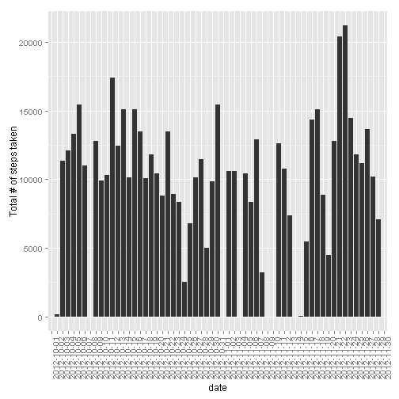
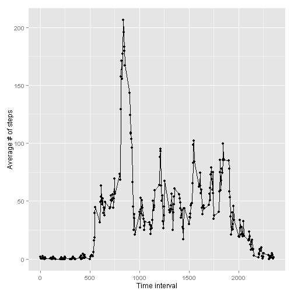
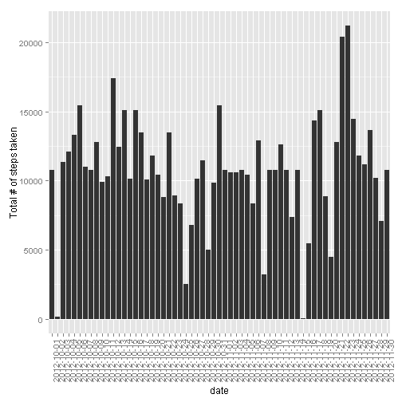
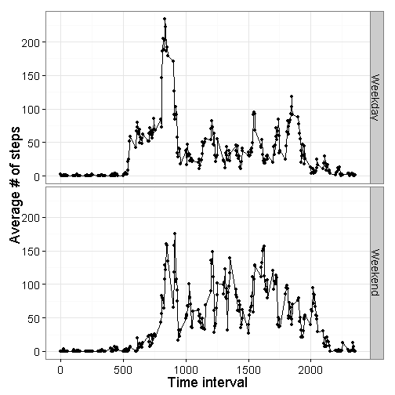

## Loading and preprocessing the data

First, let's load the data 

```r
data <- read.csv("activity.csv")
```


Now, let's check out some of the characteristics of the data 

```r
summary(data)
```

```
##      steps                date          interval     
##  Min.   :  0.00   2012-10-01:  288   Min.   :   0.0  
##  1st Qu.:  0.00   2012-10-02:  288   1st Qu.: 588.8  
##  Median :  0.00   2012-10-03:  288   Median :1177.5  
##  Mean   : 37.38   2012-10-04:  288   Mean   :1177.5  
##  3rd Qu.: 12.00   2012-10-05:  288   3rd Qu.:1766.2  
##  Max.   :806.00   2012-10-06:  288   Max.   :2355.0  
##  NA's   :2304     (Other)   :15840
```

```r
dim(data)
```

```
## [1] 17568     3
```

```r
head(data)
```

```
##   steps       date interval
## 1    NA 2012-10-01        0
## 2    NA 2012-10-01        5
## 3    NA 2012-10-01       10
## 4    NA 2012-10-01       15
## 5    NA 2012-10-01       20
## 6    NA 2012-10-01       25
```

```r
tail(data)
```

```
##       steps       date interval
## 17563    NA 2012-11-30     2330
## 17564    NA 2012-11-30     2335
## 17565    NA 2012-11-30     2340
## 17566    NA 2012-11-30     2345
## 17567    NA 2012-11-30     2350
## 17568    NA 2012-11-30     2355
```


## What is mean total number of steps taken per day?

First, let's reshape the data, so we have the total number of steps taken on each day. We will use the function `ddply()` from the package `plyr`.

```r
library(plyr)
summary__by_day <- ddply(data,
                      c("date"),
                      summarise,
                      total_steps=sum(steps))
head(summary__by_day)
```

```
##         date total_steps
## 1 2012-10-01          NA
## 2 2012-10-02         126
## 3 2012-10-03       11352
## 4 2012-10-04       12116
## 5 2012-10-05       13294
## 6 2012-10-06       15420
```


Now, let's make a histogram of the total number of steps taken each day. We will use the package `ggplot2`.

```r
library(ggplot2)

steps_hist <- ggplot(summary__by_day, aes(x=date, y=total_steps)) + geom_bar(stat="identity")
steps_hist <- steps_hist + ylab("Total # of steps taken")
steps_hist <- steps_hist + theme(axis.text.x = element_text(angle = 90, hjust = 1))
steps_hist
```

```
## Warning: Removed 8 rows containing missing values (position_stack).
```

 


Finally, calculate and report the mean and median total number of steps taken per day

```r
mean_steps <- mean(summary__by_day$total_steps, na.rm=TRUE)
mean_steps
```

```
## [1] 10766.19
```

```r
median_steps <- median(summary__by_day$total_steps, na.rm=TRUE)
median_steps
```

```
## [1] 10765
```


## What is the average daily activity pattern?
Make a time series plot of the 5-minute interval (x-axis) and the average number of steps taken, averaged across all days (y-axis).


```r
# reshape the date 
summary_by_time <- ddply(data,
                      c("interval"),
                      summarise,
                      mean_steps=mean(steps,na.rm=TRUE))

# plot it
steps_time_series <- ggplot(summary_by_time, aes(x=interval, y=mean_steps)) + geom_point() + geom_line()
steps_time_series <- steps_time_series + xlab("Time interval")
steps_time_series <- steps_time_series + ylab("Average # of steps")
steps_time_series
```

 

Which 5-minute interval, on average across all the days in the dataset, contains the maximum number of steps?

```r
tail(summary_by_time[with(summary_by_time, order(mean_steps, interval)),])
```

```
##     interval mean_steps
## 101      820   171.1509
## 103      830   177.3019
## 106      845   179.5660
## 107      850   183.3962
## 105      840   195.9245
## 104      835   206.1698
```
**The interval 835 contains the maximum number of steps, on average.**


## Imputing missing values

Calculate and report the total number of missing values in the dataset (i.e. the total number of rows with NAs)

```r
summary(data$steps)
```

```
##    Min. 1st Qu.  Median    Mean 3rd Qu.    Max.    NA's 
##    0.00    0.00    0.00   37.38   12.00  806.00    2304
```
**There are 2304 NA's**

Devise a strategy for filling in all of the missing values in the dataset. I will use the mean for that 5-minute interval

```r
data_imputed <- ddply(data, 
              .(interval), 
              function(df) {
                    df$steps[is.na(df$steps)] <- mean(df$steps, na.rm=TRUE)
                    return(df)
                    }
              )
```

Create a new dataset that is equal to the original dataset but with the missing data filled in.

```r
summary(data_imputed)
```

```
##      steps                date          interval     
##  Min.   :  0.00   2012-10-01:  288   Min.   :   0.0  
##  1st Qu.:  0.00   2012-10-02:  288   1st Qu.: 588.8  
##  Median :  0.00   2012-10-03:  288   Median :1177.5  
##  Mean   : 37.38   2012-10-04:  288   Mean   :1177.5  
##  3rd Qu.: 27.00   2012-10-05:  288   3rd Qu.:1766.2  
##  Max.   :806.00   2012-10-06:  288   Max.   :2355.0  
##                   (Other)   :15840
```
**Now there are no NA's in steps.**


Make a histogram of the total number of steps taken each day 

```r
# reshape the data
summary__by_day_imputed <- ddply(data_imputed,
                         c("date"),
                         summarise,
                         total_steps=sum(steps))

# plot it 
steps_hist_imputed <- ggplot(summary__by_day_imputed, aes(x=date, y=total_steps)) + geom_bar(stat="identity")
steps_hist_imputed <- steps_hist_imputed + ylab("Total # of steps taken")
steps_hist_imputed <- steps_hist_imputed + theme(axis.text.x = element_text(angle = 90, hjust = 1))
steps_hist_imputed
```

 

Calculate and report the mean and median total number of steps taken per day. 

```r
mean_steps_imputed <- mean(summary__by_day_imputed$total_steps, na.rm=TRUE)
mean_steps_imputed
```

```
## [1] 10766.19
```

```r
median_steps_imputed <- median(summary__by_day_imputed$total_steps, na.rm=TRUE)
median_steps_imputed
```

```
## [1] 10766.19
```

**As you can see, imputing the missing values changed the median, but not the mean number of steps taken per day. In both cases the mean number of steps taken is 10766.19. With missing values, the median is 10765. If missing values are imputed, the median number of steps is 10766.19 per day.**  


## Are there differences in activity patterns between weekdays and weekends?

Convert the date, which is currently a factor, to an actual date. Then, use an `ifelse` statement to determine if the day of the week is a weekday or weekend.

```r
data$day_of_week <- weekdays(as.Date(data$date))
data$part_of_week <- ifelse(data$day_of_week == "Saturday" | data$day_of_week == "Sunday", "Weekend", "Weekday")
unique(data$part_of_week)
```

```
## [1] "Weekday" "Weekend"
```


Make a panel plot containing a time series plot of the 5-minute interval (x-axis) and the average number of steps taken, averaged across all weekday days or weekend days (y-axis). 

```r
# reshape the data 
summary_by_time_day <- ddply(data,
                         c("interval","part_of_week"),
                         summarise,
                         mean_steps=mean(steps,na.rm=TRUE))

# plot it 
steps_time_series_byday <- ggplot(summary_by_time_day, aes(x=interval, y=mean_steps)) + geom_point() + geom_line()
steps_time_series_byday <- steps_time_series_byday + facet_grid(part_of_week~.)
steps_time_series_byday <- steps_time_series_byday + xlab("Time interval")
steps_time_series_byday <- steps_time_series_byday + ylab("Average # of steps")
steps_time_series_byday <- steps_time_series_byday + theme_bw(base_size=18)
steps_time_series_byday
```

 
